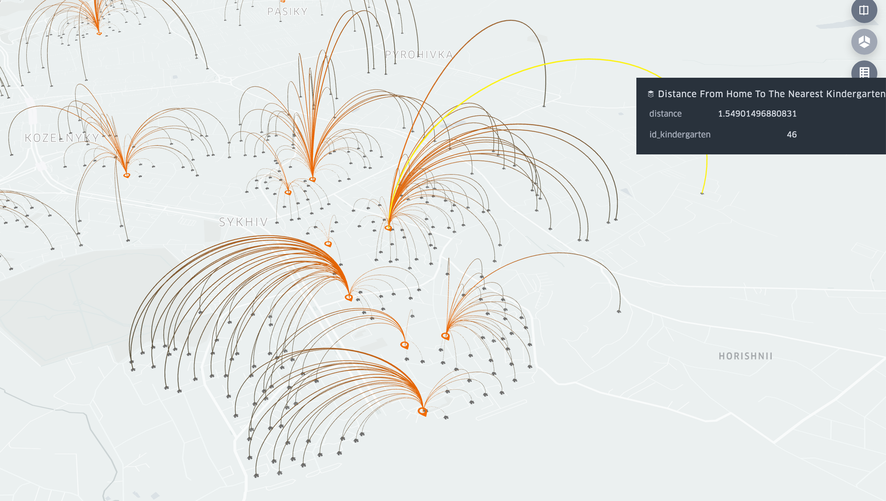

# kindergartens-ucu-summer-2019

This repo contains our work for the project we did on [UCU DS Summer School](https://apps.ucu.edu.ua/en/summerschool/). 

## Assignment
For this project we were tasked with developing a system to recommend the Lviv city council the best placement of future kindergardens. We used data from current placement requests, kindergarden locations, and demographics to understand the degree of the problem, create graphs representing the data, cluster the city into kindergarden “regions”, and create a mathematical representation of the city to show areas in need of the kindergardens. 

All the data for the project was provided to us by Lviv City Counsil. Since some of it contains sensititve information, we cannot, unfortunately, share all of the data here.

## The problem
Currently, 56% of people looking for a kindergarden in Lviv are not being accepted to the kindergarden, and 31% of the applying live farther than 400 meters from the kindergarden. The graph below shows how many people apply for a kindergarden versus how many people are accepted for different age groups. 

More details can be found [here](How_and_where_to_build_new_kindergartens_in_Lviv.pptx).

## The Solutions

In order to predict the location of future kindergartens, the visual evaluation was applied. With [Kepler.gl](https://kepler.gl/), an open-source geolocation tool, we mapped positions of existing kindergartens in Lviv and applicants’ houses. Moreover, since the initial task of this project was to locate areas of the city where parents need to travel over 400 meters from their houses to the nearest kindergarten, we aimed to visualize that as well. So based on the existing coordinates of the parents’ houses, we calculated the distances to the nearest kindergarten.

In the image below, the arc-lines represent the connection of houses to the closest kindergarten (thinner lines serve as indicators of a large distance size).

Besides, using Kepler.gl platform also makes it possible to request some additional information on the application (“house” icon in the next image). We can get an ID of a kindergarten (nearest to the applicant) and the distance to the closest kindergarten in kilometers. The map can be found [here](maps/kindergarten_and_commute.html).

In order to understand which areas in Lviv might be in need of more kindergartens, we also created a map of population density in Lviv -- see the picture below. The map can be found [here](maps/density.html).

And with kepler's magic, we can even lay the density map over the map of commute to kindergartens to see more clearly what areas lack kindergartens -- see the next two pictures showing the same area in Lviv. Find the map [here](maps/density_and_commute.html). 

Look for the arches behind the density bars ^.

And now see exactly how many applicants there were in 2019 in those areas ^.

## Grid representation 
The grid shown below is a representation of Lviv. Each block is broken down into approximately 200 meter by 200 meter regions. The demand for the region is determined by the sum of the distances that the individuals have to travel for kindergardens located more than 400 meters away from the kindergarden. 

## Clustering Lviv into kindergarden regions
We also used a clustering method to determine the regions that people apply to kindergardens from. We found that the optimal number of regions for the city ranges between 38-41 groups. 
 

The presentation of our completed project can be found [here](Forecasting_the_creation_of_additional_groups_in_kindergartens_in_Lviv.pdf).

## Contributors:
- [Anastasiia Kurdydyk](https://github.com/akurdydy)
- [Hanna Oleksiienko](https://github.com/hanna1hanna)
- [Venia Veselovsky](https://github.com/vminvsky) 
- [Khrystyna Skopyk](https://github.com/khrystyna-skopyk)